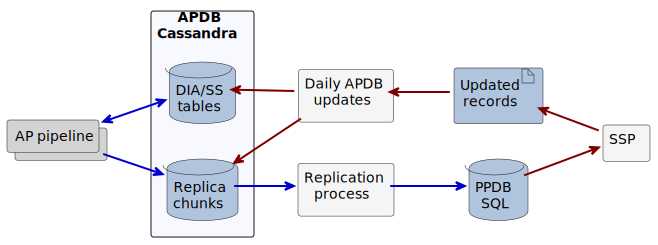
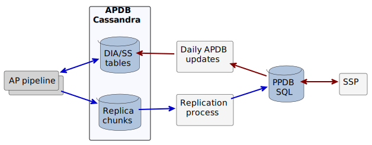

##############################################
Current status of APDB and PPDB implementation
##############################################

.. image:: https://img.shields.io/badge/DOI-10.71929/rubin/2586676-blue.svg
  :target: https://doi.org/10.71929/rubin/2586676
  :alt: DOI: 10.71929/rubin/2586676
  :height: 16

.. abstract::

   The design of the Alert Production DataBase (APDB) and Prompt Products DataBase (PPDB) has been evolving for the past few years as a result of various tests and updated requirements.
   This technical note describes the current state of these systems, as well as issues related to scalability and performance.
   It also discusses unresolved issues in the system's architecture and possible future directions.

**DOI:** `10.71929/rubin/2586676 <https://doi.org/10.71929/rubin/2586676>`_

Abridged History
================

The APDB is responsible for storage of the DIA records produced by the Alert Production (AP) pipeline.
The performance of the APDB will be critical for fulfilling the science requirements related to Alert Production.
The performance goal for alert production specifies that an alert for a visit must be issued within 60 seconds from the end of the exposure.
A significant fraction of those 60 seconds will be consumed by image analysis, and interactions with the APDB ideally should use only a small fraction of that time.

The AP pipeline processes data from each detector in parallel, which results in 189 individual processes accessing the APDB concurrently.
Initial experiments with an APDB implementation based on SQL backends (`DMTN-113`_ :cite:`DMTN-113`) demonstrated that even with very fast SSD storage a single SQL server is not able to handle this load.
To accommodate this level of concurrent IO, the APDB should be based on a horizontally-scalable architecture, preferably with high-availability features.
One attractive option fulfilling these requirements is the NoSQL database `Apache Cassandra`_.

Multiple tests were performed with a Cassandra-based implementation of the APDB (`DMTN-156`_ :cite:`DMTN-156`, `DMTN-184`_ :cite:`DMTN-184`), which demonstrated reasonable performance and scaling behavior on fast NVMe-based storage.
Based on these tests, it was determined that a Cassandra cluster with approximately 10 nodes should be able to perform adequately during the initial period of Rubin operations.
Operational experience should provide crucial information for planning future upgrades.
The USDF has commissioned a Cassandra cluster of 12 nodes to be used for testing.

Most of the tests with Cassandra only covered part of the APDB system's functionality, e.g., the components relevant to AP pipelines, and used synthetic data generated by a simple algorithm.
For more realistic studies, actual AP pipeline processes should be run at a scale similar to production operations with the LSSTCam.

The data model in the Cassandra-based APDB is optimized for querying by the AP pipeline, and for this reason, it cannot support more generic types of queries efficiently.
For more general use, such as servicing science queries, the PPDB should be used instead, as it will replicate the APDB data and provide a more flexible and familiar SQL interface.
An initial proposal of the design for this replication system was outlined in `DMTN-268`_ :cite:`DMTN-268`, with the implementation currently in development.

In addition to serving the AP pipelines and PPDB, the APDB will also be a source of data for Solar System Processing (SSP) and will receive updates from this system during the daytime.
How exactly the APDB can satisfy the additional requirements from Solar System Processing is still an open question.
There was a meeting at `JTM 2024`_ dedicated to the discussion of these requirements, but no immediate decisions resulted.
One option that seems reasonable would be using the PPDB as a source of input data for SSP, but it is not clear whether the PPDB can handle the requisite load, especially given possible limitations of the current table schema.

Current System Architecture
===========================

The preceding history indicates that certain aspects of the current architecture are more clearly defined than others.
In particular, the interface between the AP pipeline and the APDB is in a stable, working state and has been tested extensively, primarily with a SQL backend, but also recently with the USDF Cassandra cluster.
The performance and interactions of certain components are reasonably understood and benchmarked, but many aspects and details of the overall system architecture remain undefined at this time.
System requirements dictate that the states of APDB and PPDB are eventually consistent, implying that together they function as a single distributed database, so the tools used to manage their data must enforce this.

:numref:`system-architecture1` and :numref:`system-architecture2`  depict current competing ideas about what the architecture could look like for a production system, reflecting two possible options for propagating updates from SSP.
Details of the architecture are discussed in the following sections.

   High-level overview of one APDB/PPDB architecture variant.
   Blue arrows represent data flow during observations and red arrows indicate daytime data movement.
   The daily update process would receive updated records from SSP, e.g., as a set of files, write them to the regular APDB tables, and add the data to replica tables for propagation to the PPDB.

   High-level overview of another APDB/PPDB architecture variant.
   In this scheme, SSP updates PPDB directly, and a daily update process reads from the PPDB and writes to the regular APDB tables.

AP pipeline
-----------

The AP pipeline runs image analysis in parallel, with one task for each detector, and this baseline scenario could result in nearly 200 tasks attempting to access the APDB concurrently.
Additionally, processing of visits may overlap, as AP may preload data from the APDB before actual image data becomes available.
Some visits will also take longer to process than average, with their tasks possibly extending into the time window of the next visit.
The additional processing time and pre-loading of data may result in an even higher number of concurrent clients accessing the APDB compared to the baseline.

One potential performance issue with pipeline tasks is that establishing client connections to the APDB can be a resource-intensive process.
During the service discovery phase, clients need to gather information about the nodes in the cluster.
Ideally, for performance reasons, clients would maintain long-lived connections to the cluster, but this is simply not possible given the AP pipeline system architecture.
Furthermore, a single pipeline is constructed from individual tasks, and more than one task in a given pipeline could need to access the APDB, requiring a reinitiation of service discovery for each of these tasks.

Cassandra APDB
--------------

The APDB's main goal is serving AP pipeline queries efficiently, and the schema of the main tables used by AP (``DiaObject``, ``DiaSource``, ``DiaForcedSource``) has been optimized for this purpose.
The partitioning and clustering of these tables supports the types of queries used by AP pipeline tasks, and a special table was added to the schema for maintaining an external index on the latest version of ``DiaObject`` records.
To avoid unconstrained growth of data in ``DiaSource`` and ``DiaForcedSource`` tables, periodic cleanups of data outside a 12-month window are planned.

The APDB also serves as a source of data for the PPDB, but the optimized schema of the main tables cannot serve the types of queries typically used on copies of the recent data.
To facilitate an efficient transfer of the recently produced data to the PPDB, an additional set of replica chunk tables would be used, with more optimal partitioning and clustering designed to support transfers to the PPDB.
Data written by the AP pipeline is stored into the regular tables and may optionally be written to this replica chunks tables.
If replication tables are enabled, the APDB has an additional option to skip writing the data for a ``DiaObject`` not used by the AP pipeline, which saves storage space.
In this scenario, the table containing the latest version of ``DiaObjects`` would be used by the AP pipeline.

Replication Process
-------------------

A dedicated replication service will be responsible for moving recently added APDB data to the PPDB.
The APDB writes into its replication tables, which are typically partitioned by a 10-minute chunk window.
When a chunk is complete, it can be transferred to the PPDB.

The replication process watches the list of existing chunks in the APDB and decides when a new one can be transferred to the PPDB.
The identifiers of the chunks which have been successfully transferred are catalogued in a separate table within the PPDB.

Replica chunks that have been transferred to the PPDB can subsequently be deleted from the APDB.
The same replication process is responsible for this cleanup, which typically happens within a few days.

PPDB
----

There has been little discussion or decision-making regarding the exact nature of the PPDB architecture.
The general assumption has been that it will be implemented using a relational database, most likely PostgreSQL, in order to support arbitrary queries.
The volume of data in the PPDB will be large and ever-growing based on ingestion from the AP pipeline output.
A single PostgreSQL server will almost certainly be inadequate for serving arbitrary queries from multiple clients at this scale in a timely manner.

Potential schema changes over the lifetime of the Rubin survey are another issue that should be considered for the PPDB.
If database schema migrations involved non-trivial data updates, e.g., filling newly created columns with non-default data, then this process could take a significant amount of time.
Such upgrades would require careful planning in order to avoid extended system downtime.
Related to this issue, Cassandra schemas are more limited compared with a typical SQL database, which may impose constraints on changes to the data model.

Solar System Processing
-----------------------

SSP requires a list of "unassociated" ``DIASources`` from the prior two weeks (or possibly up to four) as an input to daily processing.
The query to find these records should not be run on the regular DIA tables in Cassandra, as it requires a whole-sky scan, resulting in very long query times that would not be acceptable for a production system.
One option for running these types of queries would be using the PPDB, which could maintain additional indices on ``DiaObject`` table columns.
It is unclear whether the PPDB can handle these types of queries without also performing full table scans, and additional research will be needed to determine this.

A possible alternative could be an extension to the schema, either in the Cassandra-based APDB or in the PPDB itself, which would include additional tables optimized for SSP queries.
These tables could then be populated or cleared when AP wrote new data to the APDB.
If the volume of data in these tables were kept limited, then the impact on overall performance of the APDB should be negligible.
Further research is necessary to understand which options would work best at scale.

The output of SSP is a set of records for populating the ``MPCORB``, ``SSObject``, and ``SSSource`` tables.
The contents of the first two tables needs to be re-computed every day, and at the start of the survey might contain a million records, with up to several million by the end.
``SSSource`` records produced by SSP are in addition to existing records already in the database corresponding to the same sources.

Daily APDB Updates
------------------

Before the start of the next night's observing, the APDB and PPDB will need to be updated with results from daily processing.
These update operations could include:

- replacing the ``MPCORB`` and ``SSObject`` tables
- inserting new records into the ``SSSource`` table
- re-associating ``DIASource`` records with ``SSObject`` records
- removing some records from ``DIAObject`` (possibly)
- withdrawing some ``DIAForcedSource`` records

The ``SSSource`` table is likely unneeded for AP pipeline queries, so the APDB should not need to include it.
Some of these update operations would not be trivial to perform in Cassandra and might require additional tables.

There are two possible options for performing daily updates:

1. Send all updates to the APDB first, and then propagate them to the PPDB via the regular replication process.
2. Store all updates in the PPDB and propagate them to the APDB.

There are pros and cons for each approach.
In the first case, APDB would become the authoritative source for information in the system, and the PPDB could be updated by a single agent.
This scheme would simplify the PPDB implementation, as no additional record-keeping would be needed for tracking which updates needed to be replicated.
SSP and other actors could potentially send their updates directly to the APDB using an extended API, avoiding an intermediate service.
On the other hand, this approach might make the replication procedures more complex, as they would need to handle different types of updates.

The second option would reduce the load on Cassandra, potentially improving its overall performance.
However, this approach would shift some update operations to the PPDB, changing its role from a passive data receiver to an active data source.

Unresolved Issues
=================

While there has been significant progress in implementing the APDB architecture, including recent tests with Cassandra, a number of issues remain that are not fully understood:

APDB Scalability
   All scalability tests so far have been performed with a synthetic workload using simulated data.
   Obtaining more accurate estimates of APDB performance in a production system requires testing with more realistic data payloads from the AP pipelines.
   Benchmarking with several months worth of data, or optimally a full year, would provide a more accurate picture of the system's performance.

Cassandra Operations
   Cassandra has multiple high-availability features that will be critical for achieving uninterrupted AP operations with minimal downtime.
   While these features are normally transparent to clients, the operational aspect of cluster management needs to be understood and tested using various possible failure scenarios.

Replication Service
   An initial implementation exists of the replication procedure for moving data from the APDB to the PPDB, currently implemented as a command line tool.
   This interface will need to be extended in order to cover the different replication options that were previously mentioned.
   Additionally, replication will eventually need to be implemented as a configurable service that runs as a deployed application on the Rubin Science Platform.

PPDB Scalability
   PPDB will contain a huge amount of data, and while this data volume may not be a problem for some operations, the performance of typical user queries at such scale will definitely be an issue.
   A single PostgreSQL server is likely to be inadequate for serving the needs of all science users simultaneously.
   A distributed SQL database, possibly based on PostgreSQL, would likely provide better throughput, though these types of databases sometimes have limitations in what SQL features they support.

SSP and Daily Updates
   There was little progress in understanding the SSP-APDB interface after the initial discussion of SSP needs.
   Significant effort is needed to figure out the exact requirements from the SSP side and to translate those requirements into a reasonable design.
   SSP-APDB interface may also affect the decision on how daily updates can be implemented, to chose between two options mentioned above.

.. _Apache Cassandra: https://cassandra.apache.org
.. _DMTN-113: https://dmtn-113.lsst.io/
.. _DMTN-156: https://dmtn-156.lsst.io/
.. _DMTN-184: https://dmtn-184.lsst.io/
.. _DMTN-268: https://dmtn-268.lsst.io/
.. _JTM 2024: https://confluence.lsstcorp.org/x/CQBFDg

References
==========

.. bibliography::
